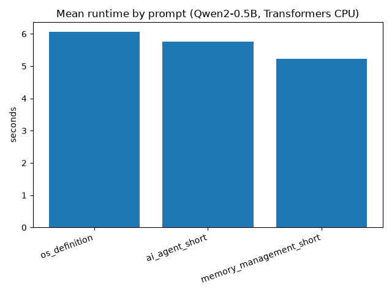
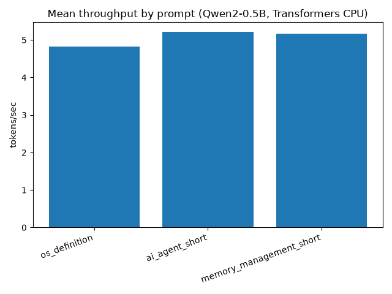
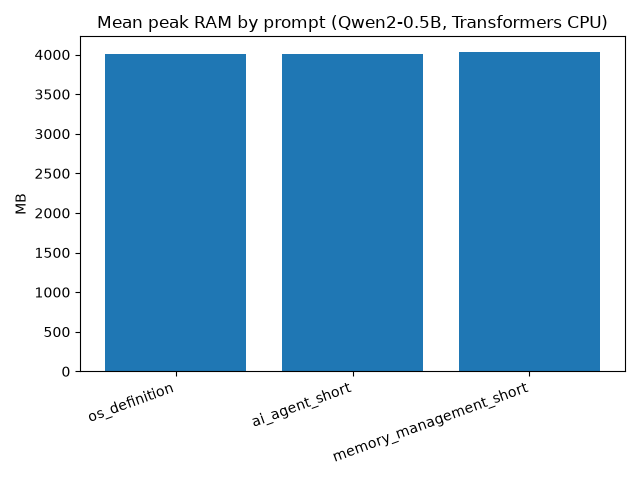
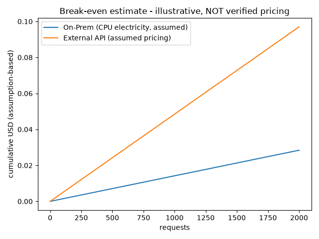

# EX05 — Running a Massive LLM Locally: AirLLM, Quantization & Performance Benchmarking

> **Technical report (final draft).** This README is the submission-facing report. It documents a
> reproducible engineering experiment in running a language model on memory-constrained local
> hardware. The headline finding is an **honest negative result**: AirLLM's CPU layer-streaming
> path for Qwen2 is **blocked in this environment** by a core meta-device parameter-streaming
> defect, so a working Hugging Face `transformers` **CPU measurement path** on `Qwen2-0.5B` is used
> as the real, repeatable evidence base. Every number here regenerates from committed data; nothing
> is fabricated. A longer companion write-up lives in [`reports/final_report.md`](reports/final_report.md).

## 1. Abstract

This project investigates how to run a model on **local (On-Premises) hardware whose memory budget
is small** (~11 GiB inside WSL2), the regime that motivates disk-backed layer-wise loading tools
such as **AirLLM**. AirLLM installs and imports correctly here, and a local re-sharding step fixes
its model-format requirement — but its actual CPU forward pass **fails** with a meta-device error
that was traced to AirLLM's own parameter streaming (PyTorch version and rotary embeddings were both
ruled out). Because reproducing that same failure on a ~15 GB `Qwen2-7B` download is not justified,
the experiment pivots to a **proven, reproducible Hugging Face `transformers` CPU path** on the
already-cached `Qwen/Qwen2-0.5B`, measured over **6 runs**. The report presents those measurements
(runtime, throughput, peak RAM, output tokens), an **assumption-based** (not market-verified)
cost/energy estimate, a mapping from the evidence to the lecture concepts, and a strict limitations
section. The guiding principle, stated in the assignment, is that **a well-analyzed negative result
outscores an unsupported positive claim**.

## 2. Project status summary

| Dimension | Status |
| --- | --- |
| **What works** | HF `transformers` **CPU** inference on `Qwen2-0.5B` (6/6 runs); the measurement SDK (typed schema, metrics collector, result writer); the analysis + figure + cost pipeline; pinned `uv` env; tests/lint/coverage gates. |
| **What failed** | AirLLM's **CPU forward pass for Qwen2** — meta-device error at its core parameter streaming (3B/3C/4A); a minimal local shim was shown infeasible. |
| **What was measured** | Wall-clock runtime, throughput (tok/s), peak RAM (RSS), output-token counts — Transformers CPU, `Qwen2-0.5B`, offline. |
| **What was not attempted** | A successful AirLLM generation; any GPU/DirectML *measurement*; a **full large-model benchmark**. *(Real TTFT in Stage 9B; dynamic-INT8 vs FP32 in Stage 9C; GGUF Q8_0 vs Q4_K_M in Stage 10A — see §7.)* |
| **Large-model pressure** | Stage 10B **attempted & evidenced** a guarded `Qwen2.5-7B` fp16 **direct Transformers CPU** baseline under a capped memory budget → a **structured negative** (`memory_budget_exceeded`): the model failed to load within budget on this WSL CPU env (§7a). A guarded memory-budget attempt, **not** a full benchmark; **no large-model performance is claimed** and weights stay git-ignored. |

### Measured evidence summary

Three measured CPU evidence groups exist, all on the cached `Qwen/Qwen2-0.5B` (offline, deterministic
— **not** a benchmark, **not** AirLLM). AirLLM itself remains a structured **negative result**.

| stage | what it measures | headline numbers | evidence |
| --- | --- | --- | --- |
| **5B** baseline (non-streaming) | runtime / throughput / peak RAM | gen ≈5.68 s mean; ≈5.07 tok/s; ≈4016 MB; TTFT `None` | `results/measurements/transformers_cpu_qwen2_0_5b/` |
| **9B** streaming TTFT/TPOT | **real TTFT** + decode-only TPOT | **TTFT mean 0.412 s** (min 0.249, max 1.160); TPOT mean **0.192 s/token**; throughput mean **5.02 tok/s** | `results/measurements/transformers_cpu_streaming_qwen2_0_5b/` |
| **9C** FP32 vs dynamic INT8 | quantization speed/quality trade-off | fp32: gen **6.03 s**, **4.83 tok/s**, **7192 MB**, **28.7** out tok · int8_dynamic: gen **1.89 s**, **17.27 tok/s**, **7086 MB**, **32.0** out tok | `results/measurements/transformers_cpu_int8_quantization_qwen2_0_5b/` |
| **10A** GGUF Q8_0 vs Q4_K_M *(diff. model/runtime)* | low-bit quantization sweep (`llama.cpp`, `Qwen2.5-0.5B-Instruct-GGUF`) | q8_0: **32.56 tok/s**, **787.6 MB**, file **675.7 MB** · q4_k_m: **31.79 tok/s**, **684.8 MB**, file **491.4 MB** (both coherent; F16 excluded >1.2 GB) | `results/measurements/gguf_quantization_qwen2_5_0_5b/` |

**Interpretation (honest):** dynamic **INT8 was ≈3.6× faster but output quality regressed and peak RAM
barely dropped (~1.5%)** in this measurement — a **speed/quality trade-off, not a free win**. TTFT is
measured **only for the Transformers CPU streaming path**, not for AirLLM. Quantization is measured
**two ways** — Transformers **dynamic INT8 vs FP32** (9C) and a **GGUF Q8_0 vs Q4_K_M** low-bit sweep
(10A, different model/runtime, not cross-comparable). The **direct large-model (>RAM) memory-pressure
baseline** was **attempted & evidenced** in Stage 10B as a guarded **structured negative**
(`memory_budget_exceeded`, §7a) — a memory-budget attempt, not a full benchmark. AirLLM stays a
structured negative result.

## 3. Hardware and environment

Hardware is measured on both layers (host + WSL2) in [`docs/HARDWARE.md`](docs/HARDWARE.md); no
specs are invented. A strict **evidence boundary** separates the physical host from what the
experiment can actually use.

- **Physical host (context):** Windows 11, ASUS Vivobook S 14, Ryzen AI 9 HX 370 (12c/24t),
  **≈ 24 GB** RAM, AMD **Radeon 890M iGPU** (no NVIDIA), ~1 TB **NVMe SSD**.
- **Experiment env (binding — Ubuntu 24.04 WSL2):** 24 CPU threads (AVX-512/VNNI), **≈ 11.24 GiB**
  RAM (WSL2 cap) + 3 GiB swap, 933 GB free ext4 on an NVMe-backed VHDX. Python 3.12, `uv`.
- **GPU for compute:** **none usable inside WSL2** — the host iGPU is detected by Windows but
  CUDA/ROCm compute is not available in Ubuntu ⇒ **CPU-only**; peak VRAM is `N/A`.
- **DirectML (optional, not the main path):** a Windows-native Python 3.11 **DirectML PyTorch tensor
  smoke succeeded** on the iGPU (`docs/GPU_FEASIBILITY.md`). It proves the device is reachable for
  tensor ops, but it is **not** used for any model measurement in this report and is kept as an
  optional future lane.
- **Measurement path:** **CPU + Hugging Face `transformers`**, the runnable, reproducible lane.

## 4. Model selection

- **Measured:** `Qwen/Qwen2-0.5B` — small, openly available, already cached locally; used for all
  real measurements here.
- **Originally the main candidate:** `Qwen/Qwen2-7B` (fp16 ≈ 15.24 GB > 11.24 GiB RAM), chosen
  precisely to be *larger than memory* for the AirLLM layer-streaming demonstration. It was
  **deferred** for AirLLM once that CPU path was shown blocked — downloading ~15 GB to reproduce a
  known AirLLM failure is not justified (`docs/MODEL_SELECTION.md`, ADR-0101a/0018).
- **Large-model pressure baseline (Stage 10B):** a same-family `Qwen/Qwen2.5-7B-Instruct` fp16 was
  later fetched to the **git-ignored** HF cache (never committed) for a **guarded direct Transformers
  CPU memory-pressure attempt** — it failed to load within a capped memory budget, a deliberate
  **structured negative** (§7a). **No large-model *performance* is claimed** (it never generated).
- **No gated/private models** and **no Hugging Face token** are required; everything runs from a
  local cache, offline.

## 5. Methodology

A staged, documentation-first engineering process; each stage leaves committed evidence and is
re-audited (`docs/REQUIREMENTS_AUDIT.md`, `docs/PLAN.md`):

1. **Requirement audit** → PRD / PLAN / TODO (traceability before code).
2. **Hardware feasibility** (Stage 1A/1B) — host vs WSL2, CPU-only determination.
3. **Backend feasibility** (Stage 1C/1D) — DirectML reachable (optional); AirLLM imports on CPU.
4. **Smoke probes** (Stage 3A–3D, 4A) — AirLLM format fix + CPU failure; HF CPU smoke success.
5. **Measurement SDK** (Stage 5A) — typed `MeasurementResult` schema, injectable-clock
   `MetricsCollector`, `ResultWriter` (stable CSV header), deterministic prompts.
6. **Measurement run** (Stage 5B) — 6 repeatable Transformers CPU runs on `Qwen2-0.5B`, offline.
7. **Analysis** (Stage 6A) — stats, figures, and an assumption-based cost/energy estimate computed
   **from committed data only**.

Engineering discipline throughout: **`uv`-locked** dependencies (`pyproject.toml` + `uv.lock`),
**TDD** with `pytest`, **ruff** lint+format, **coverage ≥ 85%**, every Python file **≤ 150 code
lines**, and reproducibility (fixed prompts/seeds, raw JSON per run, regenerable analysis).

## 6. AirLLM investigation (negative result)

AirLLM is the assignment's local-memory-management mechanism. It was investigated thoroughly and
**did not succeed** on CPU/Qwen2 here. The evidence chain (raw JSONs under `results/`, analysis in
[`docs/AIRLLM_PATCH_FEASIBILITY.md`](docs/AIRLLM_PATCH_FEASIBILITY.md) /
[`docs/SMOKE_RUN.md`](docs/SMOKE_RUN.md); direction recorded in
[`docs/EXPERIMENT_REVISION.md`](docs/EXPERIMENT_REVISION.md)):

| Stage | What was tried | Outcome |
| --- | --- | --- |
| 1D | Install + import AirLLM (pinned matrix) | **OK** — imports on CPU; `device='cpu'` is first-class |
| 3A | Upstream single-file safetensors | **FAIL** — needs `model.safetensors.index.json` (sharded format) |
| 3B | Local re-shard + untie weights | Format **fixed** → AirLLM loads & starts, then **FAIL** (meta-device) |
| 3C | Re-test under `torch==2.4.1+cpu` | **FAIL** identically → **torch ruled out** |
| 4A | Local rotary shim (no site-packages edit) | **FAIL** — diagnostic disproved rotary; meta tensor is a **layer parameter** in AirLLM's core CPU streaming ⇒ minimal safe patch infeasible (ADR-0017) |

The recurring runtime error is `RuntimeError: Tensor on device cpu is not on the expected device
meta!`. Aggregated evidence: `results/analysis/airllm_failure_summary.json` →
**`any_success: false`, 4 attempts, all `success=false`**.

**Final interpretation:** AirLLM CPU/Qwen2 is **blocked in this environment** — a documented,
root-caused limitation, **not a success**. This is reported as a valid negative result, not hidden.

## 7. Transformers CPU measurement

The runnable measurement path: direct Hugging Face `transformers` **CPU** inference on the local
`Qwen/Qwen2-0.5B` (offline, cache-only). **6 runs** across **3 deterministic prompts × 2 repeats**
(`os_definition`, `ai_agent_short`, `memory_management_short`). Details:
[`docs/MEASUREMENT_RUNS.md`](docs/MEASUREMENT_RUNS.md); full analysis:
[`docs/ANALYSIS.md`](docs/ANALYSIS.md); authoritative numbers:
`results/analysis/transformers_cpu_qwen2_0_5b_summary_stats.json`. This is a small, repeatable
measurement — descriptive, **not** a competitive benchmark.

| metric | min | mean | max |
| --- | --- | --- | --- |
| total runtime (s) | 5.16 | 5.68 | 6.57 |
| throughput (tokens/s) | 4.42 | 5.07 | 5.31 |
| peak RAM — RSS (MB) | 3985.4 | 4015.6 | 4029.1 |
| output tokens | 27 | 28.7 | 30 |

Per-prompt means:

| prompt_id | runs | mean runtime (s) | mean tok/s | mean peak RAM (MB) |
| --- | --- | --- | --- | --- |
| os_definition | 2 | 6.06 | 4.83 | 4007.2 |
| ai_agent_short | 2 | 5.76 | 5.21 | 4010.5 |
| memory_management_short | 2 | 5.23 | 5.16 | 4029.1 |

**Caveats (honest):**
- **TTFT in this Stage 5B run = None** — `generate()` was not token-streamed, so there was no
  first-token hook (never estimated). **Real TTFT is measured separately in Stage 9B** (below).
- **TPOT (Stage 5B) is approximate** = `generation_seconds / output_tokens`; the **decode-only TPOT**
  is measured in the Stage 9B streaming run.
- **Peak RAM is process RSS**; **peak VRAM is `N/A`** (no usable GPU compute).

**Stage 9B — real TTFT (streaming run, same cached model, no new download).** A separate run observes
the first generated token via `TextIteratorStreamer` (results under
`results/measurements/transformers_cpu_streaming_qwen2_0_5b/`, 6/6 succeeded;
[`docs/MEASUREMENT_RUNS.md`](docs/MEASUREMENT_RUNS.md) §8). It **supersedes Stage 5B for TTFT/TPOT**;
Stage 5B stays valid for non-streaming total-runtime/throughput.

| metric | min | mean | max |
| --- | --- | --- | --- |
| TTFT (s) | 0.249 | 0.412 | 1.160 |
| TPOT — decode-only (s/token) | 0.189 | 0.192 | 0.196 |
| throughput (tokens/s) | 4.36 | 5.02 | 5.22 |
| peak RAM (MB) | 3988.2 | 4008.2 | 4019.9 |

*The mean TTFT is skewed by the cold first run (≈1.16 s); the other five are ≈0.25–0.27 s. TTFT is
measured (streamer observation), not estimated.*

**Stage 9C Route A — dynamic INT8 vs FP32 (no-download quantization).** A real comparison of the
cached `Qwen2-0.5B` FP32 reference against a **PyTorch dynamic INT8** version of the same model
(`quantize_dynamic` on Linear modules), CPU, offline (12/12;
`results/measurements/transformers_cpu_int8_quantization_qwen2_0_5b/`,
[`docs/MEASUREMENT_RUNS.md`](docs/MEASUREMENT_RUNS.md) §9). **This is dynamic INT8 only — not GGUF,
not Q4, not Q8.**

| variant | mean tok/s | mean gen (s) | mean peak RAM (MB) |
| --- | --- | --- | --- |
| fp32_reference | 4.83 | 6.03 | 7192 |
| int8_dynamic | 17.27 | 1.89 | 7086 |

*Honest trade-off:* dynamic INT8 was **≈3.6× faster** here but **output quality degraded clearly**
(FP32 gave a coherent sentence; INT8 produced incoherent text) and peak RAM was only ≈1.5% lower
(dynamic INT8 quantizes Linear layers only; both models are held in memory during the run, so this
RAM is not comparable to the single-model Stage 5B run).

**Stage 10A — GGUF low-bit sweep (Q8_0 vs Q4_K_M, user-approved).** A separate low-bit comparison via
`llama-cpp-python` on **`Qwen/Qwen2.5-0.5B-Instruct-GGUF`** (12/12;
`results/measurements/gguf_quantization_qwen2_5_0_5b/`, [`docs/MEASUREMENT_RUNS.md`](docs/MEASUREMENT_RUNS.md)
§10). GGUF weights stay **git-ignored** under `.local_models/`, never committed.

| variant | mean TTFT (s) | mean tok/s | mean peak RAM (MB) | file (MB) |
| --- | --- | --- | --- | --- |
| q8_0 | 0.403 | 32.56 | 787.6 | 675.7 |
| q4_k_m | 0.354 | 31.79 | 684.8 | 491.4 |

*Finding:* **Q4_K_M used ~13% less peak RAM and a 27% smaller file than Q8_0 at ~equal throughput,
with coherent output for both** — the expected low-bit memory benefit. **F16 was excluded** (its GGUF
is 1266 MB, over the ~1.2 GB approval cap). **Not cross-comparable** with the Transformers stages
above: different model (`Qwen2.5-0.5B-Instruct`), different runtime (`llama.cpp`), so the much higher
throughput / lower RAM reflect the optimized runtime, not a like-for-like delta. Together with the
INT8 run, **low-bit quantization is now genuinely measured** on a small model. Low-bit *quantization*
of a large model stays out of scope; the **direct large-model memory-pressure** case is covered next.

### 7a. Stage 10B — guarded large-model (>RAM) memory-pressure baseline (structured negative)

A **guarded** direct `Qwen/Qwen2.5-7B-Instruct` **fp16 Transformers CPU** attempt — the deliberately
*larger-than-memory* case. The model snapshot was found in the **ignored HF cache** (download done;
weights **git-ignored**, never committed). To keep the parent process alive and produce a structured
record instead of an OOM kill, a child subprocess was capped at **13312 MiB** (`RLIMIT_AS`) — set
**below** the ~15.24 GB fp16 footprint on a host with ~11 GiB RAM + ~3 GiB swap. The child began the
load and raised **`Cannot allocate memory`** (`DefaultCPUAllocator`) **during model load, before any
generation**. Recorded as a **structured negative result** — the expected, in-spec outcome:

| field | value |
| --- | --- |
| attempt_type | `transformers_7b_direct_cpu_baseline` (backend `transformers`, env `wsl_cpu`) |
| success / structured_negative_result | `false` / `true` |
| failure_class | `memory_budget_exceeded` |
| download_completed / local_snapshot_found | `true` / `true` |
| load_completed / generation_completed | `false` / `false` |
| child_memory_limit_mb | `13312` |
| returncode / timed_out | `3` / `false` |
| elapsed_seconds / child_maxrss_mb | `4.65` / `871.8` |

*Evidence:* `results/measurements/large_model_pressure_qwen2_5_7b/` (`summary.csv` + result JSON). This
**demonstrates direct fp16 7B memory pressure** on the WSL CPU environment and **closes the direct
large-model pressure baseline gap**. It is a **guarded memory-budget attempt, not a full benchmark**,
and is **not** an AirLLM result — AirLLM remains blocked/not evidenced (§6).

Figures (plain matplotlib, generated from the committed data):





**Qualitative smoke sample (illustrative).** The Stage 3D smoke run preserved one short output
(`results/stage3d_smoke_transformers_qwen2_0_5b_cpu.json`), shown here as a coherence sanity-check:

> **Prompt:** "Define an operating system in one short sentence."
> **Output (16 tokens):** "An operating system is a software program that manages the hardware and
> software resources of a…" *(truncated at `max_new_tokens=16`)*

This is a **tiny Transformers CPU smoke sample** — **not** AirLLM output, **not** a benchmark, **not**
a full qualitative comparison, and **not** a quantization comparison. The Stage 5B measurement JSONs
record metrics and token counts but not generated text, so no broader qualitative table is claimed.

## 8. Cost and energy estimate

An **assumption-based, illustrative** estimate (`src/ex05_airllm/cost_model.py`;
`results/analysis/cost_energy_estimate.json`; method in [`docs/COSTS.md`](docs/COSTS.md)). It is
**not** market-verified pricing.

- **Assumptions:** CPU power **45 W** (assumed, not metered), electricity **$0.20/kWh**, assumed
  external API **$0.50 / $1.50** per 1M input / output tokens, `hardware_cost_usd = 0` (CAPEX
  excluded — sensitivity only). Marked `pricing_status = assumption_not_live_verified`.
- **Formulas:** `energy_kWh = runtime_s/3600 × W/1000`; `local_cost = energy_kWh × price`;
  `api_cost = in/1e6×in_price + out/1e6×out_price`;
  `break_even_N = hardware_cost / (api_per_req − local_per_req)`.
- **Result (per run, mean runtime ~5.68 s, ~9 input / ~29 output tokens):** energy ≈ **7.1×10⁻⁵
  kWh**; local electricity ≈ **$1.4×10⁻⁵**; assumed API ≈ **$4.9×10⁻⁵**.
- **Break-even caveat:** with `hardware_cost = 0` the break-even is **0 requests** — On-Prem looks
  cheaper *per request* only because CAPEX is excluded. This is the dominant sensitivity: any
  realistic hardware cost pushes break-even far to the right. The figure
  (`figures/cost_break_even_estimate.png`) is illustrative under the assumptions above.



> **Firm caveat:** real provider prices and a metered wattage must be sourced and dated before any
> quantitative cost claim. No live/market pricing is asserted here.

## 9. Course concept mapping

Each concept is tied to *this* evidence, with an explicit measured-vs-discussed marker:

- **Prefill vs Decode** — *Discussed + partially measured.* Prefill processes the prompt in one
  compute-heavy pass; decode emits tokens autoregressively. Our runner times the whole
  `generate()`, so prefill and decode are not separated; the measured throughput (~5 tok/s) is
  dominated by the decode loop on CPU.
- **TTFT vs TPOT / ITL** — *Discussed; TTFT not measured, TPOT approximate.* TTFT needs a first-token
  hook we did not implement (recorded `None`); TPOT/ITL is approximated as time-per-output-token.
- **Decode is memory-sensitive / memory-bound locally** — *Discussed, consistent with evidence.* On
  CPU, per-token decode is throughput-limited by moving weights + KV cache through memory, not by
  raw FLOPs — matching the modest, stable ~5 tok/s and ~4 GB RSS we observe for a 0.5B model.
- **RAM / VRAM constraints** — *Measured (RAM) / N-A (VRAM).* Peak RSS ~4 GB on an ~11 GiB budget
  for 0.5B shows why a 7B fp16 model (~15 GB) cannot fit in memory — and Stage 10B **evidences this
  directly**: the guarded `Qwen2.5-7B` fp16 attempt failed to load under a 13 GiB child budget
  (`memory_budget_exceeded`, §7a), the core motivation for layer streaming. No VRAM (CPU-only).
- **Virtual memory / paging / layer streaming** — *Discussed; this is AirLLM's premise.* AirLLM
  streams layers from disk to keep resident memory small (an explicit alternative to OS paging of a
  too-large model). Our NVMe disk is favorable for this, but the path is blocked at AirLLM's CPU
  parameter streaming (§6).
- **Quantization as a memory-reduction route** — *Discussed, not a completed run.* Lower precision
  (Q8/Q4) would shrink the resident footprint, but AirLLM's `bitsandbytes` path is CUDA-oriented
  (unavailable) and a CPU GGUF route was not executed. **No quantized inference result is claimed.**
- **On-Prem vs API trade-off** — *Discussed + illustrative estimate.* §8 sketches the trade-off
  under explicit assumptions; the honest takeaway is methodological (CAPEX dominates break-even),
  not a verified price comparison.

## 10. Reproducibility

Everything regenerates from committed data; **no model weights are committed**.

```bash
# Set up the locked environment (uv only; no pip)
uv sync --extra dev

# Run the test suite and quality gates
uv run pytest
uv run ruff check .

# Regenerate the analysis tables, figures, and cost estimate from committed measurement data
uv run python -m ex05_airllm.analyze_measurements
```

- **Inspect committed measurement data:** `results/measurements/transformers_cpu_qwen2_0_5b/`
  (`summary.csv` + 6 per-run JSONs), the Stage 10B large-model pressure structured negative
  `results/measurements/large_model_pressure_qwen2_5_7b/`, and the AirLLM failure JSONs
  `results/stage3*`, `results/stage4a*`.
- **Generated analysis** lands in `results/analysis/`, `figures/`, and
  [`reports/measurement_summary.md`](reports/measurement_summary.md) — the analysis step above reads
  only committed data, so **no model is needed** to regenerate tables/figures.
- **Re-running the measurement itself is optional.** The runner
  `ex05_airllm.run_transformers_cpu_measurement` expects a **local/cached `Qwen2-0.5B`** and is
  **not** required to inspect the committed results; the report stands on the data already in
  `results/`.
- **Do not download `Qwen2-7B`** to reproduce this report — none of the committed results depend on
  it. The measured path uses the already-cached `Qwen2-0.5B`, offline.

## 11. Limitations

- **AirLLM did not generate** on CPU/Qwen2 — blocked at its core parameter streaming (§6).
- **No full large-model benchmark** — the Stage 10B `Qwen2.5-7B` run was a **guarded memory-pressure
  attempt** that failed to load within a capped budget (a **structured negative**, §7a); it never
  generated, so **no large-model performance is claimed**.
- **Quantization is measured on a small model only** — dynamic INT8 vs FP32 (Stage 9C) and GGUF
  Q8_0 vs Q4_K_M (Stage 10A); there is **no large-model quantization**, and the two runtimes are not
  cross-comparable.
- **No DirectML measurement** — only a tensor smoke succeeded (Windows-native); no model was run on
  the iGPU.
- **Cost/API pricing is assumption-based**, not live/market-verified; the energy figure uses an
  assumed wattage, not a meter.
- **TTFT** was unavailable in the Stage 5B non-streaming run (`None`); it is now **measured** in the
  Stage 9B streaming run (§7) on the same small model only — not across quantization levels or a
  larger model.

## 12. Repository structure

```
ex05-airllm/
├── README.md                  # This technical report
├── pyproject.toml  uv.lock    # uv-locked, pinned dependency matrix (CPU torch)
├── src/ex05_airllm/           # Measurement SDK + runners (schema, metrics, writer, prompts,
│                              #   cost_model, analysis, smoke/prepare/compat) — all ≤150 lines
├── tests/unit/                # pytest suite (TDD; mirrors src/)
├── docs/                      # Audited documentation (requirements, ADRs, analysis, gap audit)
├── results/
│   ├── measurements/transformers_cpu_qwen2_0_5b/  # Raw Stage 5B data (CSV + 6 JSONs)
│   ├── analysis/              # Generated stats / cost JSON (from committed data)
│   └── stage3*/stage4a*.json  # AirLLM failure evidence (negative result)
├── figures/                   # Generated plots (runtime/throughput/RAM/break-even)
├── reports/                   # final_report.md + generated measurement_summary.md
└── config/                    # Versioned config templates (no secrets)
```

**Ignored local artifacts (never committed):** model weights/caches (`.local_models/`, `.hf_cache/`),
raw run logs (`results/raw/`), the virtual env (`.venv/`), tool caches, and local reference
material. `.gitignore` enforces this; the audits below confirm no model weights are tracked.

## 13. Conclusion

This project delivers an **honest negative AirLLM result** alongside a **working, reproducible
measurement pipeline**. AirLLM was installed, format-corrected, and driven to the point of a
root-caused CPU failure; rather than fabricate a success or burn a ~15 GB download to reproduce a
known blocker, the experiment measured a real, repeatable Transformers CPU path on `Qwen2-0.5B` and
analyzed it transparently — with cost/energy clearly marked as assumption-based. The work
deliberately prioritizes **reproducible engineering evidence over fabricated success**, in line with
the assignment's stated grading philosophy.

---

## Security & data handling

- **No secrets in the repository.** Any Hugging Face token / API key is provided via environment
  variable or interactive login only; none is committed.
- `.gitignore` excludes `.env`, credentials, model weights, caches, and large artifacts.
- **No model weights or shards are tracked** (verified by audit).

## Original analytical extensions

This project's original contributions are **analytical**, built honestly on the available evidence
(neither is a measured AirLLM success):

1. **AirLLM forensic failure analysis** — a reproducible, root-caused investigation of why AirLLM's
   CPU layer-streaming is blocked for Qwen2 here, with structured negative-result evidence (the raw
   `results/stage3*` / `results/stage4a*` JSONs aggregated to `any_success=false`). See §6.
2. **Assumption-based local-vs-API energy/cost break-even analysis** — a transparent, parameterized
   model turning measured runtimes into per-request energy/cost and an illustrative break-even, with
   every input marked as an assumption (not market-verified pricing). See §8.

## License & credits

- **Project license not explicitly declared;** the course submission repository includes
  attribution/credits and no model weights. No license is invented here (ADR-0106 left undecided); a
  license file would be added only on an explicit choice.
- **Credits:** coursework for Assignment 05 (Lecture 08). Course-provided reference material is kept
  **local only** and is **not** part of this repository or redistributed. Model:
  `Qwen/Qwen2-0.5B` (Qwen2, openly available; used from a local cache, no token).
- **Honesty:** every number traces to committed data; AirLLM is reported as a structured negative
  result, never as a success; cost/energy is assumption-based, not market-verified.

## Submission status

- **READY_FOR_HONEST_SUBMISSION (with known limitations)** — the repository is internally
  consistent, honest, and reproducible for the measured path. It is **not** submitted, **not**
  claimed 100% complete, and is **explicitly not claimed ready for a self-assessment-100 grade.**
- **Closed (Stage 9B):** **TTFT is now measured** via a real streaming run on the already-cached
  `Qwen2-0.5B` (no new download) — see §7.
- **Closed (Stage 9C + 10A):** quantization is now measured two ways — **dynamic INT8 vs FP32**
  (Transformers) and **GGUF Q8_0 vs Q4_K_M** (`llama.cpp`, user-approved download) — see §7.
- **Closed (Stage 10B):** the **direct large-model (>RAM) memory-pressure baseline** was
  **attempted & evidenced** as a guarded **structured negative** — a `Qwen2.5-7B` fp16 Transformers
  CPU attempt under a 13312 MiB child budget hit `Cannot allocate memory` during load
  (`memory_budget_exceeded`; see §7a and
  [`docs/LARGE_MODEL_PREFLIGHT.md`](docs/LARGE_MODEL_PREFLIGHT.md)). A memory-budget attempt, **not** a
  full benchmark; **still not** claimed 100% complete or self-assessment-100-ready (AirLLM remains
  blocked; quantization stays small-model; cost/energy stays assumption-based).
- **Engineering hygiene (Stage 9A):** a committed [`.env-example`](.env-example) (dummy values), a
  thin **SDK facade** (`src/ex05_airllm/sdk.py`) over the pure logic, and a fail-closed
  disabled-by-default **API gatekeeper** (`src/ex05_airllm/api_gatekeeper.py`) — the project makes
  **no live external-API calls**, so the gatekeeper requirement is `N/A_WITH_RATIONALE` with a guard
  in place.
- Other remaining experiment gaps (AirLLM generation) are documented acceptable limitations.
- **Repo:** `https://github.com/mohammedawad99/ex05-airllm` (`origin`, `main`).
- **Non-repo submission metadata** (the course **group code**) is **handled manually by the student
  in the course submission system** — deliberately **not** stored in this repository, and it does
  **not** block repository readiness.
- Optional, non-blocking (see `docs/REQUIREMENTS_AUDIT.md` §C): the student's own token-free **HF
  access** confirmation, and a real **electricity tariff** / **hardware cost** if the cost estimate
  is to move beyond assumptions.

## Evidence map & key documents

Every claim above is backed by a committed document; the primary links:

- **Extended report:** [`reports/final_report.md`](reports/final_report.md) ·
  generated summary [`reports/measurement_summary.md`](reports/measurement_summary.md)
- **Requirement audits:** [`docs/FINAL_GAP_AUDIT.md`](docs/FINAL_GAP_AUDIT.md) ·
  [`docs/REQUIREMENTS_AUDIT.md`](docs/REQUIREMENTS_AUDIT.md) ·
  [`docs/SUBMISSION_CHECKLIST.md`](docs/SUBMISSION_CHECKLIST.md)
- **Measurement & analysis:** [`docs/MEASUREMENT_RUNS.md`](docs/MEASUREMENT_RUNS.md) ·
  [`docs/ANALYSIS.md`](docs/ANALYSIS.md) · [`docs/COSTS.md`](docs/COSTS.md)
- **AirLLM negative result:** [`docs/SMOKE_RUN.md`](docs/SMOKE_RUN.md) ·
  [`docs/AIRLLM_PATCH_FEASIBILITY.md`](docs/AIRLLM_PATCH_FEASIBILITY.md) ·
  [`docs/EXPERIMENT_REVISION.md`](docs/EXPERIMENT_REVISION.md)
- **Hardware & selection:** [`docs/HARDWARE.md`](docs/HARDWARE.md) ·
  [`docs/GPU_FEASIBILITY.md`](docs/GPU_FEASIBILITY.md) ·
  [`docs/MODEL_SELECTION.md`](docs/MODEL_SELECTION.md)
- **Decisions & risks:** [`docs/DECISIONS.md`](docs/DECISIONS.md) ·
  [`docs/RISKS.md`](docs/RISKS.md) · [`docs/PLAN.md`](docs/PLAN.md)
